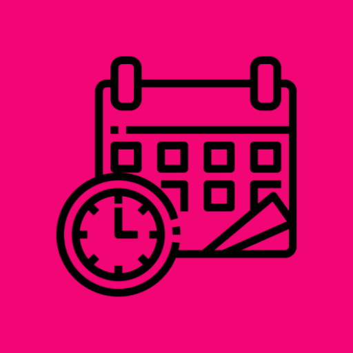

#  Timeline App

    

 

 

---

Timeline App is an Android application that displays a clean, scrollable timeline of events, showcasing start and end dates with a modern UI built using Jetpack Compose and Kotlin.

The project focuses on composable UI components, elegant date formatting, and reusable design patterns for a smooth user experience.

---

## ✨ **Features**
- Displays a vertical timeline of events with start and end dates
- Clean UI using Jetpack Compose and Material 3 theming
- Static images for each event item to enhance visual appeal
- Responsive layout with scrollable content and adaptive padding
- Color-coded event indicators for visual distinction
- Centralized screen title with custom divider styling

---

## 🛠 **Tech Stack & Architecture**
- **Android SDK**
- **Kotlin** – modern, safe, and concise language
- **Jetpack Compose** – declarative UI toolkit for Android
- **Material 3** – modern UI components and theming
- **LocalDate & DateTimeFormatter** – for date handling and formatting
- **Coil** – (optionally) image loading library if using network images
- MVVM architecture (can be extended)
- Modular, clean composable functions for maintainability

---

## 🎨 **UI & UX**
- Inspired by the design of [The Verge Timeline app](https://www.theverge.com/apps/605756/tapestry-reeder-surf-timeline-apps)
- Use of vertical colored bars to visually separate events
- Focus on readability with distinct typography hierarchy
- Centralized and prominent screen title for better orientation
- Consistent padding and spacing for balanced layout

---

## ⏳ **Development Insights**

- **Time spent:** Approximately 4 hours building and refining UI and data formatting logic.
- **What I liked:** Using Jetpack Compose for declarative UI made it easy to build reusable components and manage states smoothly.
- **What I would change:** I would implement dynamic event fetching from a backend service to make the timeline live, and add animations for item appearance.
- **Design decisions:** The timeline style was inspired by modern timeline components like The Verge Timeline app, aiming for clarity and ease of reading. Date formatting uses localized patterns for simplicity.
- **Testing:** I was unable to implement automated tests during development, but plan to add unit and UI tests in the future.
- **Build/run notes:** Requires Android Studio Flamingo or newer with Kotlin 1.8+ and Compose configured. Clone the repo, open in Android Studio, sync Gradle and run on emulator or device.

---

## ✅ **Testing & Future Plans**
- Automated unit and UI tests using Jetpack Compose testing APIs (planned)
- Allow dragging and dropping events to change their start and/or end dates
- Support for custom images per timeline event
- Custom filters including nearest dates and activity priorities

---

## 💻 **Tools Used**
- Android Studio  Narwhal Feature Drop (2025.1.2)
- Git / GitHub for version control
- Jetpack Compose Preview for rapid UI iteration

---

## 🌍 **Why this Project Matters?**

This Timeline App demonstrates:

- Clean, reusable Compose components ideal for timeline-based displays
- Proper date handling with Kotlin’s modern date/time APIs
- Effective use of Material 3 theming to create appealing UI
- Foundational structure ready to extend with networking and persistence
- Practical skills for portfolio showcasing modern Android development

---

## ⏱ **Agile Approach**
- Kanban board for task organization
- Iterative design and testing cycles

---

### ✅ Status: Completed ✔️

---

## 📱 Screenshots

  

---

> ⭐ *Thank you for visiting! Let’s build something impactful together!*